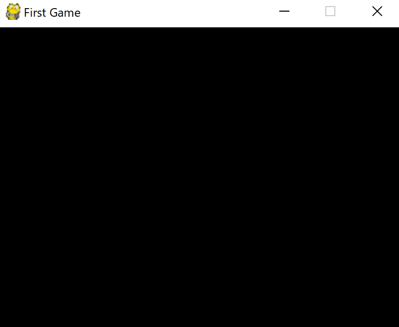

# Pygame でゲームを作ろう

## ゲームウィンドウを表示しよう

この章では下記の内容を学習します。

- Pygameの基本構成
  - いくつかのおまじない（決まりごと）
  - ウィンドウサイズを決めて、ゲームウィンドウを表示する
  - ウィンドウのタイトルにゲーム名を表示する
  - ウィンドウの閉じるボタンを押すとウィンドウが閉じる
  - メインループとフレームレート

### 完成した作品



それではコードを見ていきましょう。

`window.py` を開いてください。

### Pygameの基本構成

1. メイン関数の呼び出し
2. ゲームの初期化
3. 画面の作成
4. キャラクターなどの初期化
5. メインループ（以下の5-9を繰り返し）
6. 画面をクリア
7. キャラの場所などを更新
8. 画面へ描画
9. 画面の更新
10. イベント処理

####  1-5行目

```python
#!/usr/bin/env python
# coding: utf-8

import pygame
from pygame.locals import *
import sys
```

この部分はPygameのおまじないと考え、毎回記述するようにしましょう。
簡単に説明するとPygameに必要なライブラリを読み込んでいます。

#### 8行目

```python
def main():
```

プログラムのメイン関数です。
コードの最後にある `main()`から呼び出されます。

#### 9-11行目

```python
    # ゲームの初期化
    pygame.init()
    clock = pygame.time.Clock()
```

`pygame.init()` はPygameを初期化します。

`clock = pygame.time.Clock()` は後述の描画の速度を調整するために利用します。


これらのコードは毎回記述することになります。

#### 13-15行目

```python
    # 画面の作成
    screen = pygame.display.set_mode((400, 300))
    pygame.display.set_caption('First Game')
```

`screen = pygame.display.set_mode((400, 300))` は
横400px、縦300pxのウインドウを作成します。

`pygame.display.set_caption('First Game')`によって、表示するウィンドウのタイトルバーに「First Game」と表示されます。

#### 19行目

```python
    while True:
```

メインループに入ります。
Scratchの「ずっと」ブロックと同じです。

このループの中で、キャラクターの移動、新たなキャラの表示（弾や敵キャラ）、キャラの削除などの見た目の更新や、当たり判定（衝突判定）などの処理を行います。

#### 20-21行目

```python
        # 画面を #000000 で埋める
        screen.fill((0, 0, 0))
```

13行目で作った画面全体を黒色で埋めます。
`(0, 0, 0)` はそれぞれ「赤、緑、青」の度合いを表し、0-255のいずれかの値を指定します。

- `(255, 0, 0)` は赤
- `(0, 255, 0)` は緑
- `(0, 0, 255)` は青
- `(0, 255, 255)` は水色、
- `(255, 255, 0)`は黄色、
- `(255, 255, 255)` は白

になります。

自分で値を指定して、どのような色になるか試してみましょう。


#### 23-24行目

```python
        # 画面を更新
        pygame.display.update() 
```

先程、画面を黒色で埋めましたが、実際にはまだ画面上には反映されません。
`pygame.display.update()` を呼び出すことでモニタに表示されているウィンドウが更新され黒くなります。

#### 26-32行目

```python
        # イベント処理
        for event in pygame.event.get():
            # 閉じるボタンが押されたら終了
            if event.type == QUIT:
                # pygameの終了
                pygame.quit()
                sys.exit()
```

ここではゲーム上で発生した様々なイベントの処理を行います。
<br>
発生するイベントの一例は以下のようなものがあります。

- 閉じるボタンが押された
- マウスのボタンが押された
- 押していたマウスのボタンを離した
- キーボードが押された
- 押されていたキーボードを離した

などです。

今回のコードは`event.type` が `QUIT` ならばとなっています。
<br>
これは「ウィンドウの閉じるボタンが押された」というイベントが発生した場合の処理を記述しています。
<br>
「ウィンドウの閉じるボタンが押された」が発生すると
pygameを終了しウィンドウを閉じます。

#### 33行目

```python
        clock.tick(30)
```

ゲームにはフレームレートというものがあります。
<br>
これは1秒間に何回画面を描画するかというものです。
メインループを1秒間に何回繰り返すかとも言えます。

今回は30を指定しているので1秒間に30回ループを繰り返し、画面を描画します
<br>
これを30FPS（frame per sec）といいます。
<br>
1回の繰り返しを1フレームといいます。

1回のループの処理に時間がかかると、1秒間に30回描画ができなくなり、動きが遅くなります。


#### 35-36行目

```python
if __name__ == "__main__":
    main()
```

これはおまじないです。
メイン関数を呼び出すためにはこのような記述をしましょう。

これがPygameの基本構成です。

### まとめ

Pygameの基本構成は以下の通りです。

1. メイン関数の呼び出し
2. ゲームの初期化
3. 画面の作成
4. キャラクターなどの初期化
5. メインループ（以下の5-9を繰り返し）
6. 画面をクリア
7. キャラの場所などを更新
8. 画面へ描画
9. 画面の更新
10. イベント処理