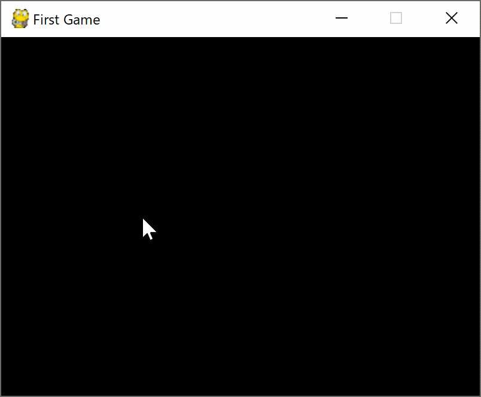

# Pygame でゲームを作ろう

## 自動で図形を動かそう1

この章では下記の内容を学習します。

- 図形の動かし方
- 画面からはみ出ないようにするには

### 完成した作品



それではコードを見ていきましょう。

`move_object.py` を開いてください。

### 図形の動かし方

#### Rect属性の取得

図形を動かすには図形を描画しているsurfaceから、その領域情報であるRect属性を取り出す必要があります。
<br>
`get_rect()`メソッドでRect属性を取り出すことができるの、変数に格納しておきます。

##### 20行目

```python
    circle_rect = circle.get_rect()
```

#### 1フレームの移動量

図形を動かすには、1フレームに左右にどれだけ移動するか、上下にどれだけ移動するかが必要になります。
<br>
今回は一定のスピードで移動するので、左右、上下ともに固定の値になります。
<br>
この左右の移動量、上下の移動量をそれぞれ、`dx`, `dy`という変数に格納しておきます。

##### 22行目

```python
    dx, dy = 5, 5
```

#### 図形の移動

ここまでで、図形を動かすのに必要なRect属性とx方向、y方向の速度が準備できました。
<br>
図形を移動させる処理を見ていきましょう
<br>
図形を移動処理はメインループの中に記述します。

##### 26行目

```python
        screen.fill((0, 0, 0))
```

まずはメインループの最初に、画面を黒で埋めます。
<br>
これによって、各繰り返しごとに新たに図形の位置を替えて描画することができます。

もしこの一行がない場合、図形が動いた軌跡が残ったままになります。


##### 28行目

```python
        screen.blit(circle, circle_rect)
        circle_rect.move_ip(dx, dy)
```

画像を描画するだけのときは`screen.blit()`の2つ目の引数は、画面の描画位置の座標を渡していましたが
<br>
今回は描画する図形から取り出したRect情報を渡しておきます。

次に`move_ip()`メソッドを使って、Rect情報を更新します。
<br>
引数は`move_ip(x方向の移動量, y方向の移動量)`です。
<br>
今回はそれぞれ`dx`, `dy`を渡しているため、フレームごとに右に5px、下に5px移動します。

1フレームごとに少しずつ、図形を移動させます。
<br>
このプログラムでは30FPSなので、1秒間で30回繰り返します。
<br>
するとパラパラ漫画のように、なめらかに図形が動いて見えます。

ここで注意が必要ですが、実際の画面の更新は前回も説明したように
<br>
`pygame.display.update()`が呼び出されたときに画面が更新されます。

この理由は、今回のプログラムを見るとわかります。
<br>
`move_ip()`で移動したあとに、`clamp_ip()`で画面内に戻しています。
<br>
`move_ip()`が呼び出されたときに実際の画面を更新してしますと、
<br>
一度図形がが画面外に出たあとに`clamp_ip()`によって画面内に戻されるという動きになってしまい不自然に見えます。

また、複数のオブジェクトを動かす場合に、`move_ip()`が呼び出されるたびに画面を更新すると
<br>
微妙にタイミングがずれて各図形が動いているように見えることがあります。

そうならないように、`move_ip()`や`clamp_ip()`が呼び出された時には
<br>
内部的に移動してはいるけど、画面は更新されない。
<br>
`pygame.display.update()`が呼び出されたときに、一気に更新する。
<br>
という流れになっています。

### 画面からはみ出ないようにするには

このまま、右下方向に進み続けると画面の外に出てしまいます。
<br>
それでは困るので画面の外に出ないようにしてみましょう。

##### 30行目

```python
        circle_rect.clamp_ip(screen.get_rect())
```

画面外に出ないようにするには、`clamp_ip()`メソッドを使います。
<br>
引数は`clamp_ip(画面の大きさのRect情報)`です。
<br>
画面の大きさのRect情報は`screen.get_rect()`で取得できるので、それを引数として渡します。

### まとめ

図形を移動させるには

1. 移動させたい図形のRect属性を取得する
2. `screen.fill()`で画面を黒で埋める
3. `blit()`に引数として1.で取得したRect属性を渡す
4. `move_ip()`で移動させる。
5. `clamp_ip()`で画面外に出ないようにする。
6. `pygame.display.update()`で画面を更新する
