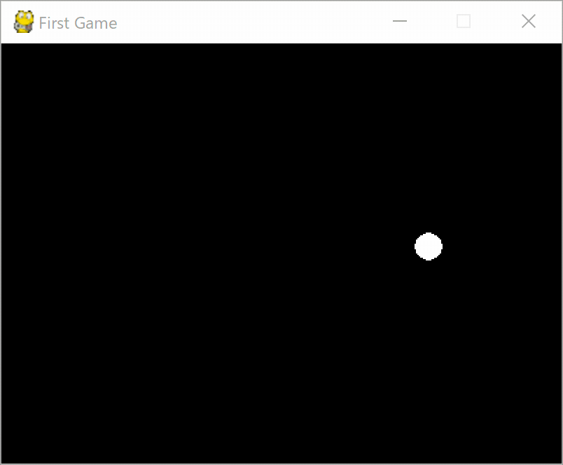

# Pygame でゲームを作ろう

## 自動で図形を動かそう2

この章では下記の内容を学習します。

- 移動の方向を変更する
- 端についた

### 完成した作品



それではコードを見ていきましょう。

`move_object.py` を開いてください。

### 移動の方向を変更する

前回作ったプログラムでは画面の右下まで行くと図形が止まったままになっていると思います。
<br>
これを端についたら跳ね返るようにしましょう

#### 下端についた場合

図形は各フレームで右方向に`dx`、下方向に`dy`だけ移動しています。
<br>
今回のプログラムではそれぞれ5pxで、右下に向かって移動しています。

ここでもし下端についた場合、どのように動いてほしいでしょうか。
<br>
今回は跳ね返るという動きをしたいので、右上に向かって移動するようにすると
<br>
跳ね返っているように見えます。

それでは、右上に向かって移動させるには`dx`, `dy`はどのようにすればよいでしょうか。

まず右に向かって動くので`dx`は今までと同じで良いです。

`dy`は、今までは下向きに`5`px移動していました。
<br>
跳ね返った場合は上向きに移動します。

上向きに移動するには`dy`を`5`減らせばよいわけです。

コードで表現すると

```python
        dy = -dy
```

このようになります。

#### 上端についた場合

次は上橋についた場合を見ていきましょう。

こちらも先程同様<br>
ボールは右上、左上方向に向かって移動しているので`dy`は`-5`となっています。

上端についたときに、`dy`を5増やせば良いので下記のようなコードになります。

```python
        dy = -dy
```

下端、上端ともに `dy = -dy` というコードになりました。


#### 右端、左端についた場合

それでは同様に右端、左端についた場合はどうでしょう

右向きに移動している場合は、`dx`が増えていきます。
左向きに移動している場合は、`dx`が減っていきます。

端についた場合は、それを反対にしてあげれば良いので
<br>
上端、下端を参考にすると

```python
        dx = -dx
```

というコードになります。


### 端についた判定

まずはRectには様々な値があるので見ていきましょう

|プロパティ名|内容|例|
|---|---|---|
|rect.top|rectの上端のy座標|0|
|rect.centery|rect真ん中のy座標|100|
|rect.bottom|rectの下端のy座標|50|
|rect.left|rectの左端のx座標|30|
|rect.centerx|rectの真ん中のx座標|20|
|rect.rigth|rectの右端のx座標|30|
|rect.height|rectの高さ|300|
|rect.width|rectの幅|400|
|rect.topleft|rectの左上の座標|(0, 0)|
|rect.midtop|rectの上端中心の座標|(10, 10)|
|rect.topright|rectの右上の座標|(20,20)|
|rect.midleft|rectの左端中心の座標|(30,30)|
|rect.center|rectの中心の座標|(40,40)|
|rect.midright|rectの右端中心の座標|(50,50)|
|rect.bottomleft|rectの左下の座標|(60,50)|
|rect.midbottom|rectの下端中心の座標|(50,10)|
|rect.bottomright|rectの右下の座標|(30,30)|

それではどうやって図形が端についたかを判断すればよいか見ていきましょう


図形が画面の下端についたかどうかは
<br>
図形の下端が画面の下端以上の場合です。

コードで表現してみましょう

```python
if rect.bottom <= screen.get_rect().bottom:
```

次に上端についたかどうかは
<br>
図形の上端が画面の上端以下の場合です。

コードにすると

```python
if rect.top >= screen.get_rect().top:
```

同様に右端は
<br>
図形の右端が、画面の右端以上の場合です。

```python
if rect.right >= screen.get_rect().rigth:
```

左端は

図形の左端が、画面の左端以下の場合です。

```python
if rect.left <= screen.get_rect().left:
```

### 端についたら跳ね返る

これらを利用して、端についたら跳ね返るを実装してみましょう

##### 32行目

```python
        if circle_rect.bottom >= screen.get_rect().bottom or circle_rect.top <= screen.get_rect().top:
            dy = -dy
        
        if circle_rect.left <= screen.get_rect().left or circle_rect.right >= screen.get_rect().right:
            dx = -dx
```

このようになります。

`circle_rect.bottom >= screen.get_rect().bottom`は下端についた
<br>
`circle_rect.top <= screen.get_rect().top` は上端についた
<br>
という意味になので、このif文は
<br>
下端についた、もしくは、上端についたという意味になります。

その場合、`dy`を`-dy`にして、y軸の移動方向を変更します。


次に
<br>
`circle_rect.left <= screen.get_rect().left`は左端についた
`circle_rect.right >= screen.get_rect().right` は右端についた
という意味なので、このif文は
<br>
左端についた、もしくは、右端についたという意味になります。

その場合、`dx`を`-dx`にして、x軸の移動方向を変更します。

これで、図形が画面の端についたら跳ね返り、画面内を動き回るプログラムが完成しました。

### まとめ

- 図形の移動の向きを変更するには`dx` `dy`をマイナスする。
- 端に触れたの判断は、図形の端と画面の端の位置を比較する